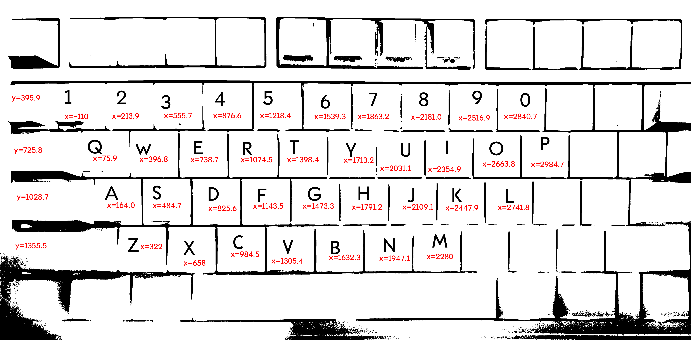
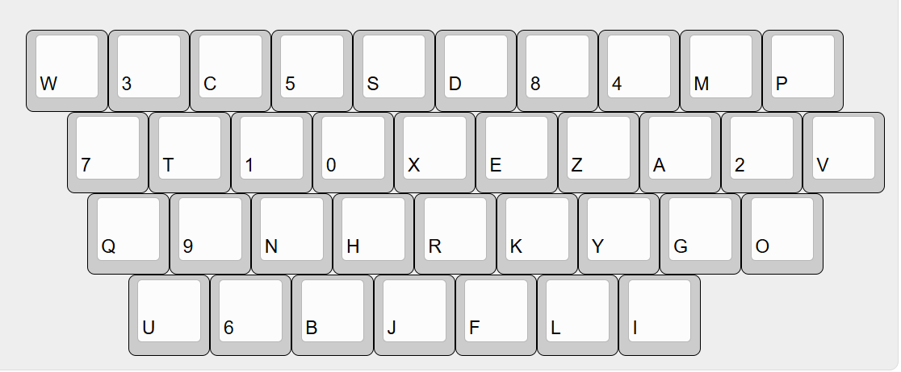

如果把“最难用”定义为“移动距离最大”，似乎我们能找到一些方案排布一个最难用的键盘…

<!-- truncate -->

---

心血来潮试图设计一个最难用的键盘（装键盘之余的突发奇想

## “最难用”

说实话这是整个流程里最难的一个部分了——怎么定义“最难用”？

从 AI 的整理和分析我们能窥见一二：

> **最困难的几种打字模式及其影响：**
> 
> 1.  **单指连续按键 (Same-finger bigrams/trigrams):**
>     - **模式：** 使用同一个手指连续按下两个或更多按键（例如，在标准QWERTY键盘上用食指连续按 "ju" 或 "mn"）。
>     - **影响：** 严重降低速度。同一个手指需要快速抬起、微调位置并再次按下，这比使用不同手指或不同手的切换慢得多。它增加了手指的负担和疲劳，容易出错，并且破坏打字节奏。
> 
> 2.  **同手相邻手指按键 (Adjacent-finger bigrams on the same hand):**
>     - **模式：** 使用同一只手的两个相邻手指连续按键（例如，在QWERTY上用右手无名指和中指按 "kl"）。
>     - **影响：** 相对较慢且容易出错。虽然使用了不同的手指，但由于手指紧挨着，容易发生误触或需要更精确的控制，尤其是在非主行位置。不如双手交替或同手跨行流畅。
> 
> 3.  **同手同排连续按键 (Consecutive keys on the same row with the same hand):**
>     - **模式：** 同一只手在同一排上连续按下多个按键，需要手指进行较大的横向移动（例如，在QWERTY上用左手按 "as" 或 "fg"）。
>     - **影响：** 速度中等偏慢。虽然使用了不同手指，但横向移动比纵向移动（跨行）或双手交替效率低。长时间或频繁出现会增加手部疲劳。
> 
> 4.  **需要大跨度或别扭姿势的按键 (Keys requiring large stretches or awkward postures):**
>     - **模式：** 按下需要手指进行较大伸展或导致手腕、手指姿势不自然的按键组合（例如，在QWERTY上用左手食指去按 'b' 或 'g'，或者用小指去按远处的符号键）。
>     - **影响：** 显著降低速度和准确性。大跨度增加了移动时间和错误率，别扭姿势会增加肌肉紧张和疲劳，长期可能导致重复性劳损。
> 
> **最简单的几种打字模式及其影响：**
> 
> 1. **双手交替按键 (Hand alternation):**
>     - **模式：** 连续的按键由左右手轮流完成（例如，在QWERTY上按 "the", "and", "is"）。
>     - **影响：** 通常是最快、最流畅的模式。当一只手按下按键时，另一只手已经准备好或正在移动到下一个按键位置。这种并行处理大大提高了效率，减少了单手的负担，维持了良好的打字节奏。
> 
> 2. **同手跨行按键 (Row alternation within the same hand):**
>     - **模式：** 同一只手连续按下的按键位于不同的行上（例如，在QWERTY上用左手按 "ed", "rf", "uj"）。
>     - **影响：** 速度较快。手指进行的是纵向移动，通常比同排的横向移动更直接和高效，尤其是在手指回位到主行时。
> 
> 3. **靠近主行的按键 (Keys close to the home row):**
>     - **模式：** 连续按下的按键都位于或非常接近键盘的主行（ASDF JKL;）。
>     - **影响：** 速度快。手指移动距离最短，减少了寻找和定位按键的时间，是打字效率的基础。
> 
> 4. **手指负荷均衡 (Balanced finger load):**
>     - **模式：** 文本中字母的出现频率使得打字任务相对均匀地分配到各个手指上，避免某个手指过度劳累。
>     - **影响：** 有助于维持长时间高速打字，减少疲劳和错误。
> 
> 总而言之，理论研究表明，打字速度受到按键模式的显著影响。那些需要重复使用同一手指、同手进行复杂或大范围移动、或导致别扭姿势的模式会降低速度并增加疲劳和错误。而那些允许双手交替、同手进行简单跨行移动、或保持手指在主行附近的模式则能显著提高速度和效率。这也是为什么一些替代键盘布局（如Dvorak、Colemak等）会通过优化字母位置来最大化双手交替和减少困难模式的出现频率，以期提高打字速度和舒适度。

一开始我也没想那么多，所以就直接定义为“移动距离尽可能长”…

## 建模分析

### 转移概率

考虑键盘上不同按键之间的转移概率 $\omega_{ij}$，这样我们在计算移动距离的时候可以考虑到常见/罕见组合因素。例如 `a->z` 的概率 $\omega_{az}=0.00012742$

一开始想找一些自然文本输入的数据集，但是这类高隐私泄露风险的数据集少之又少，只能从现有的英文文本中计算字符的转移概率，用以模拟一个人的键盘按键转移矩阵

### 优化问题

容易知道可以通过如下公式计算代价

$$
-S=\sum_{i=1}^n \sum_{j=1}^n \omega_{ij}\cdot d(p_i,p_j)
$$

其中，
 - $S$ 是总代价，这里定义为负表示目标是增加复杂度，优化目标是最小化它
 - $\omega_{ij}$ 表示按键 $i$ 到 $j$ 的转移概率
 - $d(p_i,p_j)$ 表示两个按键被分配了位置后两者距离，具体来说，如果 $i$ 被分配到位置 $a$，$j$ 被分配到位置 $b$，则可用欧氏距离 $d(p_i,p_j)=\sqrt{(x_a-x_b)^2+(y_a-y_b)^2}$ 衡量

这个问题其实本质上是一个二次分配问题（Quadratic Assignment Problem, QAP）的变体，而二次分配问题是一个 NP 难问题，因此求解需要用启发式算法

### 实际测量

首先测量键盘尺寸，拍照后二值化，然后拉标尺看看坐标（好原始的方法（



得到的结果如下

```csv
key,x,y
1,-110,395.9
2,213.9,395.9
3,555.7,395.9
4,876.6,395.9
5,1218.4,395.9
6,1539.3,395.9
7,1863.2,395.9
8,2181.0,395.9
9,2516.9,395.9
0,2840.7,395.9
q,75.9,725.8
w,396.8,725.8
e,738.7,725.8
...
```

然后是统计转移概率，这里从网络上下载了一个较小的英文文本数据集进行统计

```csv
,0,1,2,3,4,5,6,7,8,9,a,b,c,d,e,f,g,h,i,j,k,l,m,n,o,p,q,r,s,t,u,v,w,x,y,z
0,0.40532103,0.18174463,0.08636485,0.04014347,0.04397880,0.04072323,0.03936622,0.03460073,0.03444146,0.02982250,0.00477823,0.00391177,0.00517323,0.00893847,0.00332565,0.00561282,0.00054790,0.00061798,0.00057976,0.00033129,0.00066258,0.00068806,0.00111492,0.00065621,0.00044597,0.00282871,0.00009556,0.00054790,0.00149081,0.00277137,0.00049694,0.00066895,0.00021661,0.01672379,0.00014016,0.00012742
1,0.18404262,0.10112592,0.09357758,0.06983367,0.07419468,0.07422920,0.07119145,0.06459816,0.10377245,0.12294823,0.00509743,0.00453936,0.00316432,0.00369362,0.00478100,0.00310103,0.00079971,0.00144983,0.00113916,0.00027041,0.00039698,0.00076519,0.00062711,0.00059259,0.00036246,0.00077670,0.00027616,0.00092628,0.00406184,0.00125422,0.00052930,0.00035671,0.00015534,0.00057533,0.00041999,0.00037397
2,0.36603905,0.08062518,0.07627670,0.07524304,0.06384609,0.07469057,0.05381250,0.04876897,0.04971352,0.04656799,0.00482076,0.00401878,0.00408116,0.01505039,0.00304750,0.00210296,0.00113168,0.00159504,0.00163959,0.00029406,0.00090890,0.00116732,0.00127425,0.00341285,0.00171979,0.00262869,0.00024950,0.00160395,0.00327919,0.00212969,0.00062376,0.00065049,0.00022277,0.00528412,0.00068613,0.00079306
3,0.17534959,0.11097561,0.09193496,0.08508943,0.07965854,0.07248780,0.08515447,0.06892683,0.06622764,0.06305691,0.00762602,0.00570732,0.00512195,0.01897561,0.00447154,0.00445528,0.00082927,0.00252033,0.00263415,0.00134959,0.00095935,0.00193496,0.00081301,0.00214634,0.00206504,0.00245528,0.00013008,0.00408130,0.00295935,0.00409756,0.00133333,0.00053659,0.00060163,0.02183740,0.00076423,0.00073171
4,0.14647687,0.10206406,0.08705643,0.09195730,0.07526182,0.08862227,0.08538892,0.06781901,0.08244026,0.09159126,0.01234367,0.00862227,0.00510422,0.00579563,0.00422979,0.00305033,0.00093543,0.00244026,0.00321301,0.00166751,0.00067107,0.00191154,0.00209456,0.00189120,0.00109812,0.00235892,0.00071174,0.00134215,0.00351805,0.01016777,0.00138282,0.00146416,0.00221657,0.00176919,0.00050839,0.00081342
5,0.22725085,0.08644676,0.08036574,0.07750022,0.07513781,0.09180593,0.07806895,0.06745997,0.07093796,0.06577566,0.00774346,0.00584041,0.01036836,0.00776533,0.00682474,0.00540292,0.00157494,0.00148744,0.00188118,0.00059060,0.00063435,0.00142182,0.00164056,0.00183743,0.00192493,0.00279990,0.00028436,0.00107183,0.00389360,0.00680287,0.00091872,0.00100621,0.00039374,0.00142182,0.00032811,0.00339050
6,0.16087041,0.08933488,0.08339371,0.07667971,0.09141187,0.07933633,0.08890016,0.08870695,0.08047143,0.08059218,0.00886345,0.00555475,0.00422644,0.01067478,0.00521664,0.00403323,0.00156982,0.00154567,0.00260832,0.00108680,0.00272907,0.00140076,0.00089359,0.00193209,0.00159397,0.00753514,0.00077283,0.00202869,0.00347776,0.00772835,0.00079699,0.00106265,0.00053132,0.00082114,0.00070038,0.00091774
7,0.11985990,0.10675833,0.07798677,0.08356466,0.08063303,0.11474899,0.08211182,0.08916850,0.08587365,0.08081463,0.01465819,0.00565573,0.00492930,0.00874303,0.00617460,0.00638215,0.00173823,0.00210144,0.00329485,0.00090803,0.00044104,0.00095992,0.00134907,0.00095992,0.00070048,0.00194578,0.00015566,0.00140096,0.00249060,0.00928785,0.00142690,0.00119341,0.00054482,0.00038916,0.00046699,0.00018161
8,0.19498343,0.08705231,0.06827553,0.07747191,0.07165090,0.09097340,0.07484437,0.08028135,0.08155469,0.09216590,0.00796346,0.00899426,0.00747837,0.01081332,0.00384025,0.00517423,0.00222330,0.00238499,0.00240521,0.00058614,0.00040424,0.00121271,0.00123292,0.00303177,0.00097017,0.00218288,0.00084890,0.00208182,0.00335516,0.00574016,0.00082868,0.00458808,0.00026275,0.00151589,0.00044466,0.00018191
9,0.11262609,0.08940251,0.09344862,0.09825223,0.06891328,0.07857592,0.06747219,0.06713964,0.08655729,0.14283339,0.00777815,0.00642944,0.00639249,0.00528397,0.00714998,0.00375051,0.00073902,0.00175516,0.00190297,0.00064664,0.00134870,0.00249418,0.00182907,0.00186602,0.00218010,0.00362118,0.00184754,0.00297454,0.00327015,0.01304364,0.00816613,0.00829546,0.00016628,0.00131175,0.00048036,0.00005543
a,0.00018706,0.00043260,0.00016963,0.00013788,0.00010728,0.00010031,0.00008869,0.00014059,0.00017080,0.00040201,0.00541472,0.02613246,0.05239737,0.03738907,0.00378383,0.00873380,0.02874900,0.00431520,0.04796328,0.00278423,0.00846115,0.10546785,0.03973489,0.17883199,0.00200075,0.02657087,0.00144343,0.11004137,0.07862743,0.14536967,0.03417610,0.02068715,0.00416919,0.00404642,0.01792034,0.00285162
...
```

最后模型的求解通过随机交换+模拟退火实现，退火过程中，有一定概率接受交换造成的代价上升

## 求解结果



## Conclusion

这种东西就不要 Conclusion 了罢，其实细活儿都集中在设计距离函数上，要是考虑文本段/误击率甚至于中文拼音的重码…确实是个大活儿…