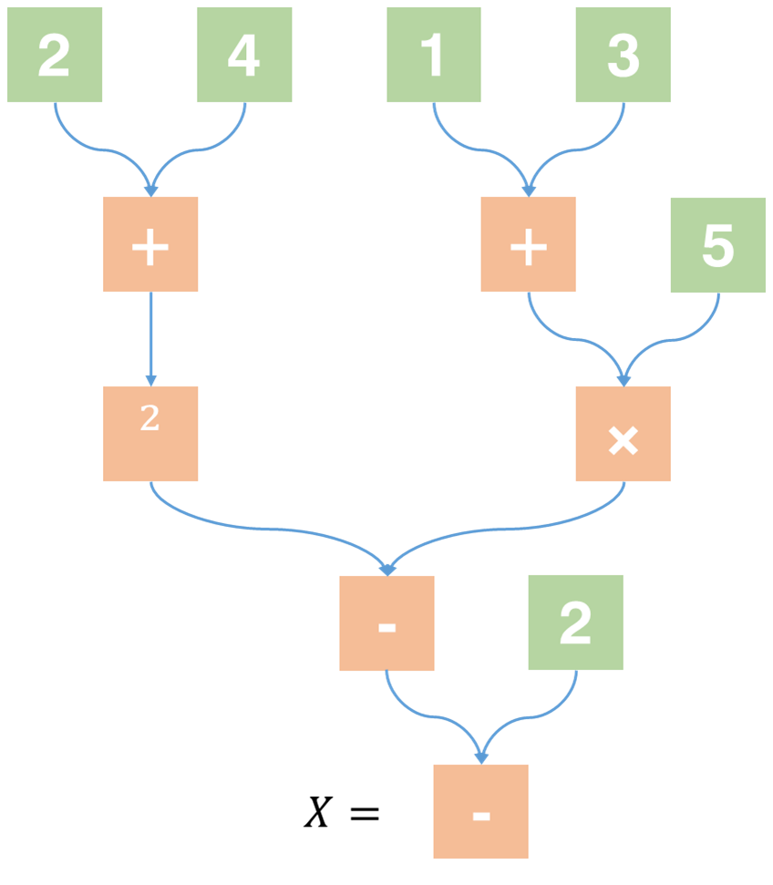

# 常数自动搜索器

***TIPS: 也许未来某一天会做成 Bilibili 视频***

**标题...？** 恶臭问题の彻底解决？不仅仅是搜索了20亿次...

# I. 一朝凑一式，臭名天下扬

曾经在网上看到过这样一个算式：

$$\mathrm{e}[(\mathrm{e}+\pi)(\mathrm{e}+\mathrm{e}+\pi)]^\mathrm{e}+\frac{\mathrm{e}}{(\pi^\mathrm{e}-\mathrm{e})(\mathrm{e}+\mathrm{e}^\pi-\pi^\mathrm{e})}\approx114514.1919810$$

 > 日本数学家田所浩二曾经说过，“如果一个人第一次看到这个公式而不感受到它的魅力，那么他不可能成为Homo”。

确实，十分经典而有趣。但由此我们会问出两个问题：

1. 这样的算式是**怎么构造**出来的？
2. 这些算式会不会有构造的**通法**？
3. 这些算式会不会有**内在的结构**，以致于我们可以通过分析这些结构辅助算式的构造？

现在，我们可以开始探索这个问题：**如何利用 $\mathrm{e}$ 和 $\pi$ 两个常数，构造一个结果近似为 $114514$ 或 $114514.1919810$ 的算式？**

# II. 手工无添加，纯天然制造

23年的时候我写了一篇文章投稿在zhihu上 [启发式逼近：寻踪在野兽般的自然常数中](https://zhuanlan.zhihu.com/p/634314228)

最直观而便捷的方式自然就是手工构造，说白了就是直觉。假定我们的计算器上有这么几个按键

$$+\quad-\quad \times\quad \div \quad$$

 很容易构造一些是是而非的式子，不仅冗长，而且不太优雅，充斥着人工雕琢的痕迹。最重要的一点，这种方法是纯粹的暴力方法，每一次实验都需要“硬凑”。例如：

$$\frac{e^{e^e}+e^{e\tan(\frac{\pi}{e-\frac{\pi+\pi^{-e}}{\pi+\pi}})}+\pi^{\pi e-\log{\pi}}-e^{\pi^{\log\pi}}}{(\pi-\log\pi)\pi^e-\frac{\pi}{e}-\pi^{-e}}\approx114514$$

这个公式有误，但是由于找不到原稿，所以就暂时不换新的了。可以看到，这里各种对数、三角混用，穷形尽相，甚不美观。究其原因，我认为有以下因素造成这种情况：

1. 人难以感知**嵌套层数较高**的计算。加减乘除，多套几层，别说计算，就连修改式子后，分析计算变大还是变小都会很迷糊。
2. 人难以感知**复杂函数**的计算。例如，$\sin \frac{\log x}{\tan x}$ 这种函数，一眼根本没法看出单调性，函数本身充斥着间断与突变，只能通过不断微调函数内部的数值达成逼近的效果，而此时计算困难又回到了第一条之所述。

怎么办呢？有一个直观的想法，既然我们无法对一个复杂的系统做出有效感知，只需要将这个系统拆成零散的、易理解的部分，分块感知它，就能减少理解难度。

基于这个想法，不难想到，我们列出一些常用的计算式，然后像搭积木一般，把它们搭起来就好了。例如，通过计算我们知道：

$$\left( \begin{array}{cc}  \pi  & 3.14159265358979 \\  e & 2.71828182845905 \\  e+\pi  & 5.85987448204884 \\  -e+\pi  & 0.42331082513074 \\  \pi ^e & 22.4591577183610 \\  e^{\pi } & 23.1406926327793 \\  \pi ^{\pi } & 36.4621596072079 \\  e^e & 15.1542622414793 \\  e \pi  & 8.53973422267357 \\  \pi \pi & 9.86960440108936 \\  ee & 7.38905609893065 \\  \frac{\pi }{e} & 1.15572734979092 \\  \frac{e}{\pi } & 0.86525597943226 \\  \log (\pi ) & 1.14472988584940 \\  \log_\pi (e ) & 0.87356852683023 \\  \sqrt{\pi } & 1.77245385090552 \\  \sqrt{e} & 1.64872127070013 \\  ^\pi\sqrt{e} & 1.37480222743936 \\  ^e\sqrt{\pi} & 1.52367105485893 \\ \end{array} \right)$$

看着挺哈人，但是这个表格扩充了我们的“常数工具箱”，让我们在拼凑的时候更得心应手，降低人力成本。诸如

$$-\pi  \left(\pi ^{\pi }+e\right)+\left(e^{\pi  e+\pi }-e^{e \pi }\right)+\pi ^{e \sqrt{\pi }} (e+\pi )-\left(e^{\pi }+\pi ^e\right)\approx114514.5130$$

此类。

其实到这里人工基本也已经到头了。当然可以尝试去计算更多的常数，然而随着 $\mathrm{e}$ 和 $\pi$ 个数的增加，我们的常数工具箱内容数量也会指数级增长。由此，我们要引入计算机辅助计算了。

# III. 科技造狠活，主打一个香

首先要提醒的一点，计算机可不会像人一样写公式！（GPT不在考虑范围内）如果将一个公式直接用文本存到计算机里，想必编写程序处理这串字符也是累死累活。

因此，需要想办法给算式找到一个比较通用的“结构”，按照这个“结构”存储算式后，计算机就可以方便地“按图索骥”：中间这个加号、右边那个乘号......好得很。这个结构，就是**树**。

回忆我们学过的运算法则，是不是有一些常见**规则**？例如，先算括号，接着次幂，再次乘除，最后加减。实际上，计算机也是一样的，如果按照这些规则组织算式，不仅符合人的规律，也便于其读取。

观察下式的计算顺序：

$$X=(2+4)^2-(1+3)\times5-2$$

首先我们会计算括号里面的内容。不妨令 $A_{1}=(2+4)$, $A_{2}=(1+3)$，这样我们就有

$$X=A_{1}^2-A_{2}\times5-2$$

然后我们要计算平方和乘法。令 $B_{1}=A_{1}^2$, $B_{2}=A_{2}\times5$，于是有

$$X=B_{1}-B_{2}-2$$

如果我们把这些算式按照计算顺序连起来，我们会得到下面这张图：

这就是我们所说的“结构”，也就是树。这种可以被树形式表达出来的表达式叫做**中缀表达式**，也就是运算符放在两个数字（或上一层的计算结果）中间的算式。观察树的结构，我们还发现：

1. **叶子节点**（图中绿色，没有箭头指向它的节点）都是数字
2. 其它节点都是运算符
3. 每个运算符有两个儿子节点（具有这条性质的树称为**二叉树**）
4. 按照计算顺序，这些节点被逐层组织

那么如何让计算机计算一个这样的算式就比较了然了，从叶子节点开始逐步向上计算即可。

现在回到我们最关键的问题：如何去用计算机寻找一个合适的算式？最直接的想法，应该是让计算机生成**所有可能**的算式，然后逐个去计算它们的值，找到其中最接近目标常数的算式。这个过程称之为**搜索**。不过，我们很快会意识到这个算法的问题所在：要搜索的公式，实在是太多了。

简单做一个计算。假设要搜索的二叉计算树有 $l$ 层，初始提供的常数一共有 $c$ 个，而运算符一共 $s$ 个。

由此，所有可能的运算符组合有

$$s^{2^{l-1}-1}$$

种，则整个二叉计算树的可能组合有

$$c^{2^{l-1}}s^{2^{l-1}-1}$$

种。举例计算，令 $c=2$, $s=6$, $l=6$，得到一共可能有

$$5697031531194475351894806994354176\approx5.697\times10^{33}$$

种组合可能。这个计算量的复杂度量级已经超越了指数，达到了两层指数塔的增长速率，因此完全搜索所有的可能算式是不太可能的。

一旦确定性算法遇到困难，除了想方设法、绞尽脑汁思考新的算法，我们还有一条出路，就是寻找一个**不确定性算法**，也就是**随机算法**，这些算法的效果往往意外地好。实际上随机算法在生活中也时常可见，**投点法估计圆的面积**就是最简单的随机算法之一。总而言之，确定性算法和随机算法的区别是：

- **确定性算法**：在相同输入条件下，总是产生相同的输出。其执行过程是可预测的。
- **随机算法**：在相同输入条件下，可能会产生不同的输出。其执行过程包含随机性。

那么，针对这个问题，最简单而朴素的随机算法，也就是，随机分配所有的运算符，以及叶子节点的常数，尝试随机搜索一个结果足够接近目标的算式。

## 🚧 施工中