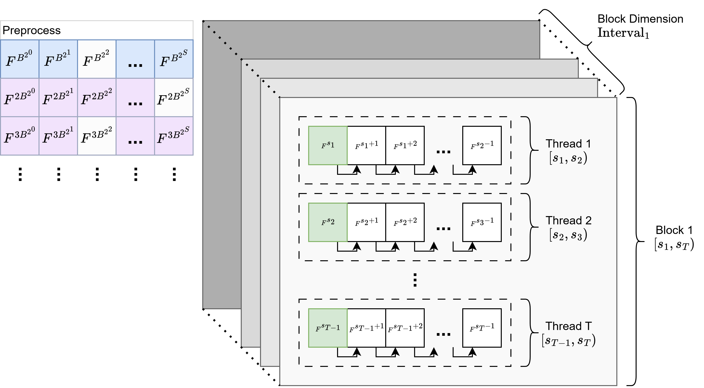
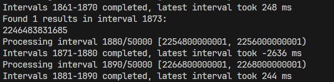

# 豪俊斐波那契 / 基于CUDA的万亿斐波那契数子串寻踪

初学 CUDA，忍不住上手试验一番并行优化。直入正题，任务目标为：

**寻找第 $n$ 个斐波那契数 $F_n$，使其低位含有指定的子串**

这个问题似乎有一个数学上的算法，暂时不太了解，因此仅做第一次写 CUDA 的练习。初学难免犯错，如有错误请指出。下述算法如果未特殊说明，默认在**模意义**下讨论。

## 斐波那契数列的并行递推

首先是构建搜索过程，如何并行化搜索呢？斐波那契数的计算是**串行**的，即 $F_{n+2}=F_{n+1}+F_n$，如果直接进行并行，每个线程将承受极不平衡的计算量，并且速度也极慢。

那还有什么办法呢？很快就能想到基于**递推矩阵**的方法。我们有

$$
\begin{bmatrix}
F_{n+1}\\F_{n}  
\end{bmatrix}
=\begin{bmatrix}
1 & 1 \\
1 & 0
\end{bmatrix}
\begin{bmatrix}
F_{n}  \\
F_{n-1} 
\end{bmatrix}
$$

由此递推，容易得到第 $n$ 个斐波那契数的一般表达式

$$
\begin{bmatrix}
F_{n+1}  \\
F_{n} 
\end{bmatrix}
=\begin{bmatrix}
1 & 1 \\
1 & 0
\end{bmatrix}^{n}\begin{bmatrix}
F_{1}  \\
F_{0} 
\end{bmatrix}
$$

令 $F_{0}=F_1=1$，也就得到 $F_{n}$ 了。当然，这里还有一个 $n$ 次方，最自然的想法就是利用矩阵快速幂。记 $F=\begin{bmatrix}1 & 1\\1 & 0\end{bmatrix}$，先用 $O(\log n)$ 次矩阵乘法处理出所有 $F^{2^k}$ 的矩阵，接下来再用 $O(\log n)$ 对 $F_{n}$ 的每一位进行矩阵乘法，就大功告成啦。

然而还没结束。注意到计算 $F^{2^k}$ 是一个重复性的工作，因此我们可以将这个流程在 CPU 主机端进行**预处理**，然后剩余的每一位的矩阵乘法，交由 CUDA 进行处理即可。

## 快速幂算法的并行优化

继续优化！注意到在 int128 的限制下，每一个线程都要对它们所负责的数字进行 128 次矩阵乘法——还是稍多，经过考虑，我们可以从**进制**的角度优化一下这个算法。

回顾二进制矩阵幂的过程，主要由两步构成：

1. 预处理出 $F^{2^0}$，$F^{2^1}$，$F^{2^2}$，...，$F^{2^S}$ 这些幂矩阵，每一个幂矩阵都可以由前一个平方得到，这里一共需要 $S$ 次矩阵乘法，储存 $S$ 个矩阵
2. 每个并行线程对于给定数字 $N$，将 $N$ 写成 128 位的二进制，如果第 $k$ 位为 $1$，则累乘一个 $F^{2^k}$，直到最后累乘得到 $F^N=F^{2^{k_{1}}}\cdot F^{2^{k_{2}}}\cdot \dots$，这里一共需要至多 128 次矩阵乘法

如果我们不拘泥于二进制呢？例如，将基数 $2$ 换成另一个更大的基数 $B$，我们的矩阵幂过程，就会变成这样：

1. 预处理出 $F^{1\cdot B^0}$，$F^{1\cdot B^1}$，$F^{1\cdot B^2}$，...，$F^{1\cdot B^S}$ 这些幂矩阵，每一个幂矩阵都可以由前一个平方得到，这里一共需要 $S+1$ 次矩阵乘法，储存 $S+1$ 个矩阵
2. 对于每个 $F^{1\cdot B^k}$ 矩阵，继续预处理出 $F^{2\cdot B^k}$、$F^{3\cdot B^k}$、...、$F^{(B-1)\cdot B^k}$ 这些矩阵，每个矩阵都可以由前一个矩阵乘上 $F^{B^k}$ 得到，这里一共需要 $(B-2)\times(S+1)$ 次矩阵乘法，储存同样多个矩阵
3. 每个并行线程对于给定数字 $N$，将 $N$ 写成对应位的 $B$ 进制，如果第 $k$ 位数字为 $d_{k}$，则累乘一个 $F^{d_{k}\cdot B^k}$，直到最后累乘得到 $F^N=F^{d_{k_{1}}\cdot B^{k_{1}}}\cdot F^{d_{k_{2}}\cdot B^{k_{2}}}\cdot \dots$，这里一共需要至多 $\log_{B}(2^{128})$ 次矩阵乘法

这里多了一步，也就是将这些幂矩阵的“中间倍数”结果也求了出来。可以看到，当 $B>2$ 时，$\log_{B}(2^{128})<128$，因此这样做确实能减轻内核的计算负担！

那么 $B$ 怎么取比较好呢？注意到如果取 $B$ 为 2 的幂，则位移起来十分方便快捷，因此可令 $B=2^b$。令 $b=8$，即 **256 进制的矩阵快速幂**，我们来看看占用情况：

1. 预处理第一阶段，需要 $S+1$ 次矩阵乘法
2. 预处理第二阶段，需要 $254\times(S+1)$ 次矩阵乘法
3. 并行线程，每个线程至多 $\log_{256}(2^{128})=16$ 次乘法

非常好！通过将一些计算量下放到主机端预处理，每个 CUDA 线程的计算压力都从 128 次矩阵乘法下降到 16 次，美哉。

相关代码如下

**主机端**

```CPP
// 计算 Fibonacci 矩阵的 BASE 的幂次方与倍数，结果存储在动态分配的数组中
__host__ Mat2x2** fibo_mat_Bpows() {
    /*
    计算并返回 Fibonacci 矩阵的 BASE 的幂次方与倍数矩阵
    例如，对于 BASE = 4。返回矩阵形如
    I    1 * F^(4 ^ 0)    2 * F^(4 ^ 0)    3 * F^(4 ^ 0)
    I    1 * F^(4 ^ 1)    2 * F^(4 ^ 1)    3 * F^(4 ^ 1)
    I    1 * F^(4 ^ 2)    2 * F^(4 ^ 2)    3 * F^(4 ^ 2)
    ...
    I    1 * F^(4 ^ MAX_MATS_NUM)    2 * F^(4 ^ MAX_MATS_NUM)    3 * F^(4 ^ MAX_MATS_NUM)
    其中 F 是 Fibonacci 矩阵
    */
    // 分配连续内存以便于GPU传输
    Mat2x2 *flat_mats = new Mat2x2[(MAX_MATS_NUM + 1) * BASE];
    Mat2x2 **mats = new Mat2x2*[MAX_MATS_NUM + 1];
    // 设置指针数组指向连续内存的相应位置
    for (int row = 0; row <= MAX_MATS_NUM; row++) {
        mats[row] = &flat_mats[row * BASE];
        mats[row][0] = {1, 0, 0, 1};

        if (row == 0) {
            mats[row][1] = {1, 1, 1, 0}; // F^1 = Fibonacci矩阵
        } else {
            // 计算 F^(BASE^row) = (F^(BASE^(row-1)))^BASE
            Mat2x2 base_power = mats[row - 1][1]; // F^(BASE^(row-1))
            mats[row][1] = base_power;
            for (int i = 1; i < BASE; i++) {
                mats[row][1] = multiply(mats[row][1], base_power, MOD);
            }
        }

        // 计算 col * F^(BASE^row)
        for (int col = 2; col < BASE; col++) {
            mats[row][col] = multiply(mats[row][col - 1], mats[row][1], MOD);
        }
    }

    return mats;
}
```

**设备端**

```CPP
    // 找到 start_idx 对应 BASE 进制表示，并得到对应矩阵的模乘，即 F(start_idx)
    const Mat2x2 Identity = {1, 0, 0, 1};
    Mat2x2 bound_fib_mat = {1, 0, 0, 1}; // 初始为单位矩阵 I
    Mat2x2 fibo_recursion = {1, 1, 1, 0};
    // 将 start_idx 按 BASE 进制分解并计算对应的矩阵乘积
    uint128 temp_idx = start_idx;
    for (int pos = 0; pos <= MAX_MATS_NUM && temp_idx > 0; pos++) {
        unsigned int digit = temp_idx & (BASE - 1); // 等价于 temp_idx % BASE
        // 避免分支发散，使用三元运算符
        // digit 为 0，相当于乘以单位矩阵，不改变结果
        const Mat2x2& mat_to_multiply = (digit > 0) ? mats[pos][digit] : Identity;
        bound_fib_mat = multiply(bound_fib_mat, mat_to_multiply, MOD);
        temp_idx >>= W_BASE; // 下一个幂次的处理
    }
```

## 子串检查算法

因为在 GPU 中执行分支会导致分支发散，导致线程空转严重，因此子串检查不能采取一般的 KMP 等算法的思路，而要用顺序性较好、分支较少的检查方式。

这里的检查就较为简省，每次对待检数字进行检查时，都会右移一个十进制位，然后看看除去对应位的 $10^k$ 后，余数是否就是要找的那个子串。

```CPP
// 检查 N 是否包含 TARGET_NUMBER 作为十进制子串
__device__ bool contains_decimal_substring(uint128 N) {
    if (N < TARGET_NUMBER) {
        return false;
    }
    uint128 temp_N = N;
    const int MAX_CHECKS = 40 - M; // uint128 的十进制最大有 39 位
    for (int i = 0; i < MAX_CHECKS; ++i) {
        uint128 remainder = temp_N % SUB_NUMBER_10POW;
        if (remainder == TARGET_NUMBER) {
            return true;
        }
        temp_N /= 10;
        if (temp_N < TARGET_NUMBER) {
            break;
        }
    }
    return false;
}
```

也许比较耗时？不过感觉也差不多优化到较好了... 可能有些数学或工程的奇技淫巧吧...

## 分块策略

因为最终要丢到 GPU 上算的嘛，因此如何分块也是比较重要的。这里分块的方式也比较简单，详见下图



## 一嘴数学

斐波那契数列的模数其实是有周期性的，其被称为匹萨诺周期[^1] $\pi(p)$，通过 CRT 定理不难得到，对于模数 $p$，其最小周期大小不会超过 $6p$。

## 运行测试

CMake 后运行，指定数字进行测试，每秒约有二十亿个斐波那契数被搜索。



成功确认：**$F_{2246483831685}$ 以 1145141919810 结尾（难视**

[^1]: [斐波那契数列 - OI Wiki](https://oi-wiki.org/math/combinatorics/fibonacci/)
