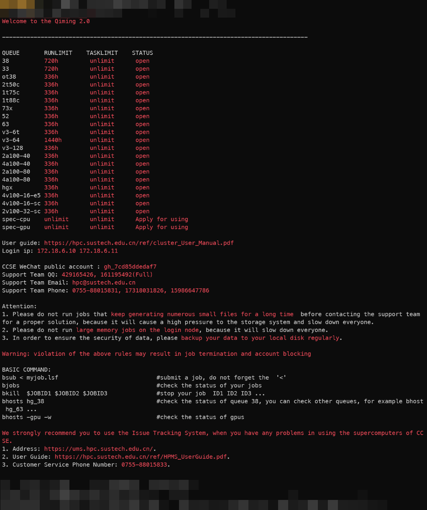

# 熟练掌握启明超算的进入与退出

*都不许笑...你猜猜安装 python 能卡住多少朋友们...*

## 登录启明

**启明是南方科技大学自建的超算，所以首先得是一位校友对吧...**

嗯，首先得**拥有一个启明超算的账号**，这个...应该是有导师申请，或者参加了 HPC 相关培训、`ASC` 等 HPC 比赛就能拥有

可以从 [Quick Start for Supercomputers (Version 2024.11)](https://hpc.sustech.edu.cn/ref/QuickStartforClusterPlatformofCCSE.pdf) 看到更多的教程（记得连校园网，不能挂代理）

可看到如下的节点登录命令：

```shell
ssh -p 18188 username@172.18.6.10 
```

`18188` 表示登陆节点开放的登录端口，`username` 是你拥有的账号名字，而后面的 `172.18.6.10` 则是超算地址了

在登陆后会提示输入密码，输入后登录成功

似乎还有太乙的登录...不过太乙也忒老了些

## 计算队列与节点

启明采用超算的一贯管理模式，拥有大量的**计算节点**，每个节点会类似于一个完整的计算机（当然也有许多不同）

节点根据类型被组织为**队列**，用户可以向队列 or 节点提交自己的计算任务（称为**作业**），计算节点会对这些作业进行计算

刚才我们进入的节点是**登录节点**，只用来登录、安装环境与做一些编译工作，**不能**用于运行计算任务（~~会导致别人卡住然后被管理员肉身威胁~~）



执行以下命令以查看所有的队列

```shell
bqueues
```

```shell
QUEUE_NAME      PRIO STATUS          MAX JL/U JL/P JL/H NJOBS  PEND   RUN  SUSP
test             60  Open:Active       -    -    -    -   176     0   176     0
spec-gpu         40  Open:Active       -    -    -    -    60     0    60     0
spec-cpu         40  Open:Active       -    -    -    -   165     0   165     0
dataq            33  Open:Active       -    -    -    -     0     0     0     0
38               30  Open:Active       -    -    -    -   424     0   424     0
ot38             30  Open:Active       -    -    -    -     0     0     0     0
2t50c            30  Open:Active       -    -    -    -   256     0   256     0
73x              30  Open:Active       -    -    -    -     0     0     0     0
63               30  Open:Active       -    -    -    -     4     0     4     0
v3-6t            30  Open:Active       -    -    -    -   432     0   432     0
v3-64            30  Open:Active       -    -    -    -  1320     0  1320     0
v3-128           30  Open:Active       -    -    -    -     0     0     0     0
1t75c            30  Open:Active       -    -    -    -   512     0   512     0
1t88c            30  Open:Active       -    -    -    -   960    48   912     0
52               30  Open:Active       -    -    -    -     0     0     0     0
33               30  Open:Active       -    -    -    -    80     0    80     0
2a100-40         30  Open:Active       -    -    -    -     0     0     0     0
4a100-40         30  Open:Active       -    -    -    -    14     0    14     0
2a100-80         30  Open:Active       -    -    -    -     8     0     8     0
4a100-80         30  Open:Active       -    -    -    -     9     5     4     0
hgx              30  Open:Active       -    -    -    -     8     0     8     0
2v100-32-sc      30  Open:Active       -    -    -    -     1     0     1     0
2v100-32-e5      30  Open:Active       -    -    -    -     6     0     6     0
4v100-16-e5      30  Open:Active       -    -    -    -     6     0     6     0
4v100-16-sc      30  Open:Active       -    -    -    -    16    12     4     0
4a100-96         30  Open:Active       -    -    -    -     0     0     0     0
ssc-gpu          30  Open:Active       -    -    -    -     0     0     0     0
ssc-cpu          30  Open:Active       -    -    -    -   152     0   152     0
dcu              30  Open:Active       -    -    -    -     0     0     0     0
```

`NJOB` 指的是目前**在该队列上运行的作业总数**，`PEND` 便是**等待队列中的作业数**

好像 `2a100-40` 这个队列比较空，可以用以下命令查看队列的节点状况

```shell
bhosts hg_2a100-40
```

```shell
HOST_NAME          STATUS       JL/U    MAX  NJOBS    RUN  SSUSP  USUSP    RSV
b05u37g            ok              -     40      0      0      0      0      0
```

`bhosts` 命令表示查看某个节点的情况，在队列名前加前缀 `hg_` 以查询该队列下节点的运行状态

当然，如果想要直接查看可用节点，可以直接运行 `bhosts`，如果只希望查看带 GPU 的节点情况，可以用 `bhosts -gpu -w`

回到我们的作业，现在我们确定了希望使用 `2a100-40` 队列中的 `b05u37g` 这个计算节点

## 作业脚本的编写

因为登录节点和计算节点的储存位置实际上相同，所以我们需要先在登录节点上配置环境

这里以 `conda` 为例，试图在计算节点上启动一个 `jupyter` 笔记本

### 安装 conda

可以去 Conda 官网找到 `miniconda` 的下载链接，用 `wget` 下载到登录节点你的工作目录中，接下来 `sh` 安装该包

安装好后启动 `conda`，创建一个环境 `conda create -n YourEnvName`，然后 `conda activate YourEnvName` 激活环境

接下来 `pip install jupyter` 安装 `jupyter` 笔记本即可

> **在这里其实卡住过，环境变量没配置好导致未能识别到 conda 命令**
>
> 这个时候可以手动补充路径 `./miniconda/bin/conda` 做好 init 与 activate 工作

### 编写 LSF 作业脚本

**LSF** 是什么？文档告诉我们...

> LSF（Load Sharing Facility）是一款分布式集群管理系统软件，负责计算资源的管理和批处理作业的调度。 它给用户提供统一的集群资源访问接口，让用户透明地访问整个集群资源。 同时提供了丰富的功能和可定制的策略。 LSF 具有良好的可伸缩性和高可用性，支持几乎所有的主流操作系统。 它通常是高性能计算环境中不可或缺的基础软件。

这里直接给出一个在 GPU 节点上挂在 jupyter 的 lsf 脚本...

```shell
#!/bin/bash
#BSUB -q 2a100-40
#BSUB -n 6
#BSUB -e %J.err
#BSUB -o %J.out
#BSUB -gpu "num=1"
#BSUB -R "affinity[core(1)]"

# # # # # # # # # # # # # # # # # # # # # #
# GPU jupyter notebook setup
# # # # # # # # # # # # # # # # # # # # # #

## Move to directory:
cd /work/your_work_dir


## Setup environment
module load cuda/12.1
source ~/.bashrc

export PATH=/work/ssc-test5/miniconda3/envs/test-python-env/bin:$PATH

./miniconda3/bin/conda activate test-python-env

# get tunneling info
export XDG_RUNTIME_DIR="" node=$(hostname -s)
user=$(whoami)
submit_host=${SLURM_SUBMIT_HOST}
port=1145
echo $node pinned to port $port
# print tunneling instructions

echo -e "
To connect to the compute node ${node} running your jupyter notebook server, you need to run following two commands in a terminal 1.
Command to create ssh tunnel from you workstation/laptop to glogin:

ssh -p 18188 -L ${port}:${node}:${port} ${user}@172.18.6.10

Copy the link provided below by jupyter-server and replace the NODENAME with localhost before pasting it in your browser on your workstation/laptop "

# Run Jupyter
jupyter notebook --no-browser --port=${port} --port-retries=50 --ip=${node}
```

解析一下上面的命令

1. `#BSUB` 相关配置

这是启明超算要求作业脚本给出的作业参数，其中

 - `-q` 表示作业使用的队列
 - `-n` 表示作业使用的 CPU 核数，推荐设置为 **最大核数 / GPU 总数量 * GPU使用数量**
 - `-e` 标准错误输出流重定向到的文件
 - `-o` 标准输出流重定向到的文件
 - `-gpu` 设定使用的显卡数量
 - `-R` 这个参数是管理员推荐加上的，虽然我也不太清楚有啥用...

2. `module load cuda/12.1` 加载 `CUDA` 工具包
3. `export PATH=...` 这个命令是为了解决 `conda` 无法自动启用的问题，如果没有啥问题，也不一定需要这一句...
4. `# get tunneling info` 及以下命令，设定一些变量，储存当前信息，同时设定要进行 jupyter GUI 映射的端口号，这里是 1145
5. `jupyter notebook ...` 正式启动 jupyter

这样就写好了一个作业脚本，我们将其命名为 `gpu_job.lsf`

### 提交作业脚本并连接到 jupyter

提交作业脚本用 `bsub` 命令，例如

```shell
bsub -m "b05u37g" < gpu_job.lsf
```

这样能够把 `gpu_job.lsf` 提交到 `b05u37g`，注意节点应该对应作业脚本中指定的队列

如果提交成功，会看到如下输出

```shell
Job <xxx> is submitted to queue <2a100-40>
```

表示 ID 为 xxx 的作业已经被移交到对应队列

等待几秒，刷新一下文件列表，可以看到自己的工作目录下出现了两个输出文件，分别是 `xxx.out`（标准输出）与 `xxx.err`（标准错误输出）

打开 `xxx.out` 文件，如果没有出错，可以看到 `echo` 命令输出了对应的连接提示：

```
To connect to the compute node b05u37g running your jupyter notebook server, you need to run following two commands in a terminal 1.
Command to create ssh tunnel from you workstation/laptop to glogin:

ssh -p 18188 -L 1145:b05u37g:1145 username@172.18.6.10

Copy the link provided below by jupyter-server and replace the NODENAME with localhost before pasting it in your browser on your workstation/laptop
```

再查看 `xxx.err` 文件，理论上应该会输出如下信息：

```
[I 2024-12-22 11:43:29.220 ServerApp] Jupyter Server 2.15.0 is running at:
[I 2024-12-22 11:43:29.221 ServerApp] http://b05u31g:1145/tree?token=...
[I 2024-12-22 11:43:29.221 ServerApp]     http://127.0.0.1:1145/tree?token=...
[I 2024-12-22 11:43:29.221 ServerApp] Use Control-C to stop this server and shut down all kernels (twice to skip confirmation).
[C 2024-12-22 11:43:29.224 ServerApp] 
    
    To access the server, open this file in a browser:
        file:///work/username/.local/share/jupyter/runtime/jpserver-...-open.html
    Or copy and paste one of these URLs:
        http://b05u31g:1145/tree?token=...
        http://127.0.0.1:1145/tree?token=...
```

代表 jupyter 已经启动成功

现在我们在本地打开命令行窗口，将 `xxx.out` 中输出的 ssh 命令粘贴进去，进行远程计算节点的端口的转发

```shell
ssh -p 18188 -L 1145:b05u37g:1145 username@172.18.6.10
```

然后打开浏览器，复制 `xxx.err` 文件中最后一个网址，访问转发到本地的 jupyter 笔记本

```
http://127.0.0.1:1145/tree?token=...
```

如果看到 Jupyter 笔记本的界面，表示成功连接，可以在计算节点使用笔记本了


