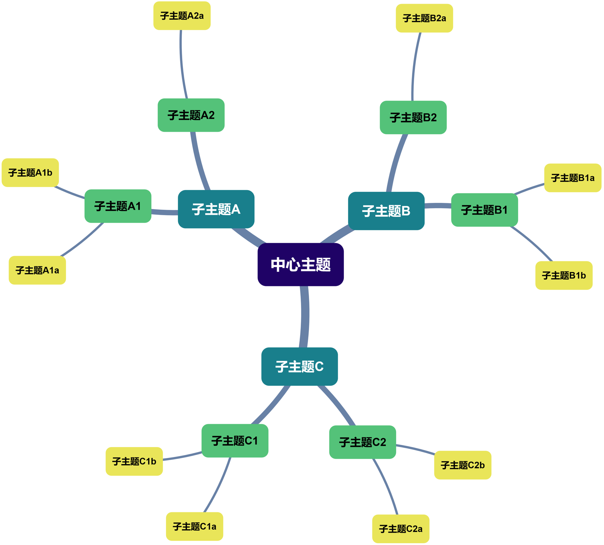
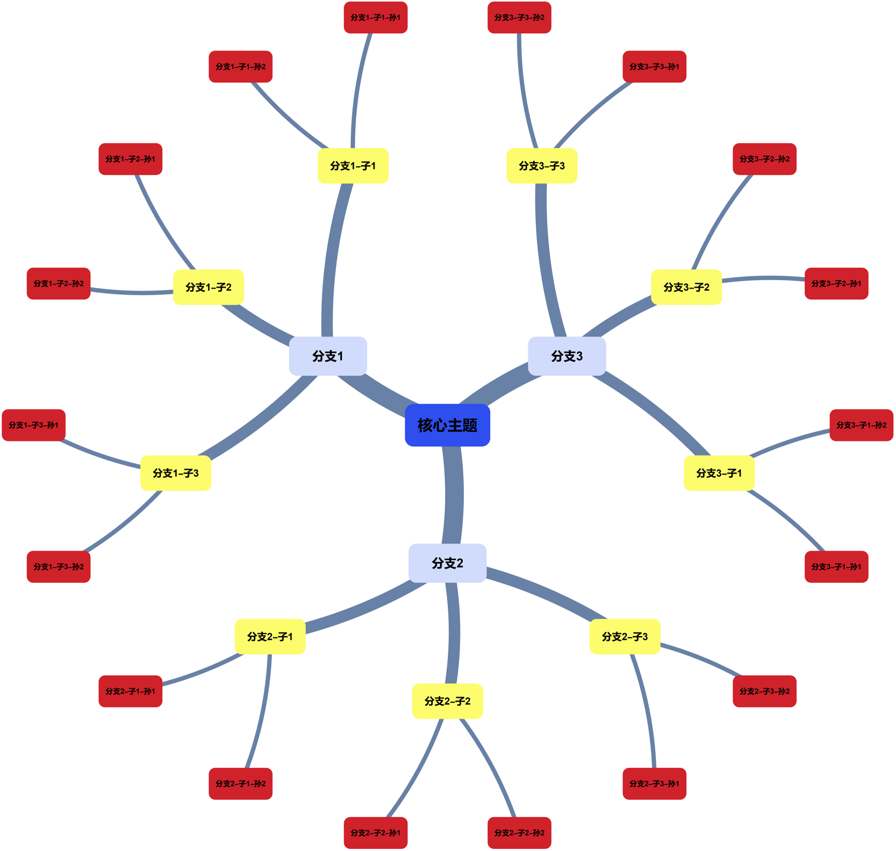
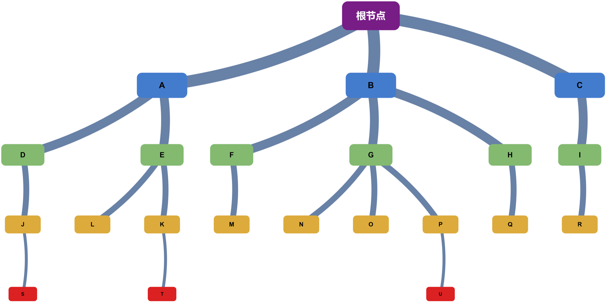

# Mathematica 思维导图绘制

*本文已经同步于知乎* 👉 [Mathematica 思维导图绘制！](https://zhuanlan.zhihu.com/p/16488372920)

看到一个问题所以写了这篇文章...

其实思维导图软件很多，用起来也不错，用 Mathematica 还是会有点折磨的对吧（？

懒得手写，对着 Deepseek 和 4o 动了一中午嘴皮子，也算拿出个像样的导图轮子来

---

上代码：

```javascript
CreateMindMap[nodes_,edges_,center_,options:OptionsPattern[{ColorScheme->"BlueGreenYellow",VertexSizeRange->{100,60},FontSizeRange->{18,10},EdgeThicknessRange->{0.02,0.004},GraphLayout->"RadialEmbedding",ImageSize->800}]]:=Module[{g,depths,maxDepth,colorScheme,vertexColors,vertexSizes,fontSizes,fontSizesAssoc,brightness,fontColors,fontColorsAssoc,depthAssoc,edgeDepth,vertexColorsAssoc,edgeThickness,mindMap},
(*创建图并计算节点深度*)
g=Graph[nodes,edges];
depths=GraphDistance[g,center,#]&/@nodes;
maxDepth=Max[depths];
(*定义颜色方案和节点大小*)
colorScheme=ColorData[OptionValue[ColorScheme]];
vertexColors=colorScheme/@Rescale[depths,{0,maxDepth}];
vertexSizes=Rescale[depths,{0,maxDepth},OptionValue[VertexSizeRange]];
(*定义字体大小*)
fontSizes=Rescale[depths,{0,maxDepth},OptionValue[FontSizeRange]];
fontSizesAssoc=AssociationThread[nodes->fontSizes];
(*定义亮度计算函数和字体颜色*)
brightness[color_]:=ColorConvert[color,"HSB"][[3]];
fontColors=If[brightness[#]<0.6,White,Black]&/@vertexColors;
fontColorsAssoc=AssociationThread[nodes->fontColors];
(*创建边到深度的关联*)
depthAssoc=AssociationThread[nodes->depths];
edgeDepth=depthAssoc[#[[2]]]&/@edges;
(*边到颜色的关联*)
vertexColorsAssoc=AssociationThread[nodes->vertexColors];
(*设置边的粗细*)
edgeThickness=Rescale[edgeDepth,{0,maxDepth},OptionValue[EdgeThicknessRange]];
(*绘制思维导图*)
mindMap=Graph[nodes,edges,VertexShapeFunction->(Inset[Graphics[{vertexColorsAssoc[#2],Rectangle[{-1,-0.5},{1,0.5},RoundingRadius->0.2],Text[Style[#2,fontColorsAssoc[#2],fontSizesAssoc[#2],Bold],{0,0}]},ImageSize->vertexSizes[[Position[nodes,#2][[1,1]]]]],#1]&),EdgeShapeFunction->GraphElementData["CurvedArc","Curvature"->0.2],EdgeStyle->Thread[edges->(Thickness[#]&/@edgeThickness)],GraphLayout->OptionValue[GraphLayout],ImageSize->OptionValue[ImageSize]];
mindMap]
```

咳，看看效果吧

**例 1**

```javascript
nodes={"中心主题","子主题A","子主题B","子主题C","子主题A1","子主题A2","子主题B1","子主题B2","子主题C1","子主题C2","子主题A1a","子主题A1b","子主题A2a","子主题B1a","子主题B1b","子主题B2a","子主题C1a","子主题C1b","子主题C2a","子主题C2b"};
edges={"中心主题"->"子主题A","中心主题"->"子主题B","中心主题"->"子主题C","子主题A"->"子主题A1","子主题A"->"子主题A2","子主题B"->"子主题B1","子主题B"->"子主题B2","子主题C"->"子主题C1","子主题C"->"子主题C2","子主题A1"->"子主题A1a","子主题A1"->"子主题A1b","子主题A2"->"子主题A2a","子主题B1"->"子主题B1a","子主题B1"->"子主题B1b","子主题B2"->"子主题B2a","子主题C1"->"子主题C1a","子主题C1"->"子主题C1b","子主题C2"->"子主题C2a","子主题C2"->"子主题C2b"};

CreateMindMap[nodes,edges,"中心主题",ColorScheme->"BlueGreenYellow",VertexSizeRange->{120,80},FontSizeRange->{20,12},EdgeThicknessRange->{0.02,0.004},GraphLayout->"SpringEmbedding",ImageSize->800]
```



**例 2**

```javascript
nodes={"核心主题","分支1","分支2","分支3","分支1-子1","分支1-子2","分支1-子3","分支2-子1","分支2-子2","分支2-子3","分支3-子1","分支3-子2","分支3-子3","分支1-子1-孙1","分支1-子1-孙2","分支1-子2-孙1","分支1-子2-孙2","分支1-子3-孙1","分支1-子3-孙2","分支2-子1-孙1","分支2-子1-孙2","分支2-子2-孙1","分支2-子2-孙2","分支2-子3-孙1","分支2-子3-孙2","分支3-子1-孙1","分支3-子1-孙2","分支3-子2-孙1","分支3-子2-孙2","分支3-子3-孙1","分支3-子3-孙2"};
edges={"核心主题"->"分支1","核心主题"->"分支2","核心主题"->"分支3","分支1"->"分支1-子1","分支1"->"分支1-子2","分支1"->"分支1-子3","分支2"->"分支2-子1","分支2"->"分支2-子2","分支2"->"分支2-子3","分支3"->"分支3-子1","分支3"->"分支3-子2","分支3"->"分支3-子3","分支1-子1"->"分支1-子1-孙1","分支1-子1"->"分支1-子1-孙2","分支1-子2"->"分支1-子2-孙1","分支1-子2"->"分支1-子2-孙2","分支1-子3"->"分支1-子3-孙1","分支1-子3"->"分支1-子3-孙2","分支2-子1"->"分支2-子1-孙1","分支2-子1"->"分支2-子1-孙2","分支2-子2"->"分支2-子2-孙1","分支2-子2"->"分支2-子2-孙2","分支2-子3"->"分支2-子3-孙1","分支2-子3"->"分支2-子3-孙2","分支3-子1"->"分支3-子1-孙1","分支3-子1"->"分支3-子1-孙2","分支3-子2"->"分支3-子2-孙1","分支3-子2"->"分支3-子2-孙2","分支3-子3"->"分支3-子3-孙1","分支3-子3"->"分支3-子3-孙2"};

CreateMindMap[nodes,edges,"核心主题",ColorScheme->"TemperatureMap",VertexSizeRange->{120,90},FontSizeRange->{20,10},EdgeThicknessRange->{0.03,0.005},GraphLayout->"RadialEmbedding",ImageSize->1200]
```



**例 3**

```javascript
nodes={"根节点","A","B","C","D","E","F","G","H","I","J","K","L","M","N","O","P","Q","R","S","T","U"};
edges={"根节点"->"A","根节点"->"B","根节点"->"C","A"->"D","A"->"E","B"->"F","B"->"G","B"->"H","C"->"I","D"->"J","E"->"K","E"->"L","F"->"M","G"->"N","G"->"O","G"->"P","H"->"Q","I"->"R","J"->"S","K"->"T","P"->"U"};

CreateMindMap[nodes,edges,"根节点",ColorScheme->"Rainbow",VertexSizeRange->{100,50},FontSizeRange->{16,8},EdgeThicknessRange->{0.025,0.005},GraphLayout->"LayeredDigraphEmbedding",ImageSize->1000]
```



效果还行罢~

如果希望自定义更多效果，也可以缝缝补补（比如连接线颜色一类的需求...）

---

奇怪，为什么 Mathematica 没法高亮，要不先用 js 高亮顶着...