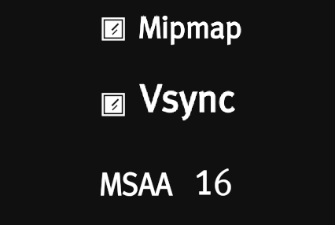

# 基于 LibGDX 的 Sokoban 开发总结

这是我的一个**期末作业**，要求开发一个**推箱子**游戏，并且实现一个给定的功能

**项目地址** 👉 [Sokoban](https://github.com/LifeCheckpoint/Sokoban)

<div style={{
  display: 'flex',
  flexDirection: 'column',
  alignItems: 'center',
  justifyContent: 'center',
  textAlign: 'center',
  margin: '20px 0'
}}>
<p style={{
    fontSize: '20px', 
    color: 'white',
    marginTop: '10px'
  }}>
    项目最终的**文件结构**
</p>


</div>

## 开发准备

知道作业内容后立马就开始和 `ChatGPT` 讨论什么引擎最合适开发游戏...一番争论，最后选了 `LibGDX`

`ChatGPT` **非常自信地告诉我：**

### ✅ 为什么选择 LibGDX？

1. **粒子系统**：LibGDX 内置粒子引擎，并且提供了一个粒子编辑器，您可以直观地设计粒子效果并导入游戏中。例如，在箱子移动或撞击墙壁时生成粒子效果，增加游戏的视觉冲击力。
2. **动画和缓动支持**：LibGDX 支持缓动库（如 Universal Tween Engine），可以为推箱子、移动、缩放、旋转等效果设置缓动过渡，使动画更加自然。比如，在推动箱子时增加一个轻微的缓动或弹性效果，提升体验。
3. **画面动效**：LibGDX 的场景管理和摄像机控制功能让您可以实现画面摇晃、缩放等效果，适用于模拟冲击感和视觉反馈。例如，推箱子撞到墙壁时可以让摄像机产生轻微抖动，提升游戏的互动感。
4. **简单易用**：LibGDX 提供的 API 非常易于上手，对于新手或小团队开发者友好。您可以在较短时间内掌握基本操作，同时框架支持跨平台，可以方便地在桌面和移动端上测试和发布。

嗯，项目完成后，我也要**吐槽**的是

### ❌ 为什么别用 LibGDX？

1. **老土没用过的粒子系统**：全程没用过
2. **简单到有点简陋的动画**：有动画，有缓动曲线，这点还可以，但是动画的稳定性...实在难以苟同（例如，两个位移动画同时执行，不能指望最终位移是矢量和；两个动画明明分开执行，却能意想不到地杂交到一起并产生前述效应）
3. **Bug 无数**：也许是个人开发的原因吧，感觉 bug 无数...从查找了一堆网友答案才知道**根本没有任何效果**的“设置组件顺序” `setZIndex()`，到各种坐标管理的混乱（当然我的问题更严重一些233...）

建议还是用 `Unity` or `Unreal` 来制作游戏

*个人的新手体验角度，横看成岭侧成峰，人人眼中自不同*

## 项目“特色”

1. 基于主流游戏引擎 LibGDX 开发，移植性强，可维护性高
2. 允许素材异步加载，支持启用 Mipmap MSAA 等显示优化
3. 原创美术素材，附加素材源文件，实现大量自定义的 GUI 动画组件，界面美观整洁
4. GUI 代码采用 服务定位器 与 单例模式 的结合设计 ，通过 gameMain 分发全局控制句柄，简化开发，重用率高
5. 核心功能基于 TestNG 进行了充分单元 / 覆盖率测试
6. 通过 JNI 高效进行跨语言协作，并且保证游戏对特定平台 api 的兼容

（發自我的Github）

如果逐条拆解的话，其实应该是这样的...

|吹的|实际上|
|---|---|
|✅移植性强|❌用了特定平台编译的文件框，只能在 Win 上跑|
|✅可维护性高|❌可维护性高 ≠ 有人维护|
|✅大量自定义动画组件|❌自带的 UI 组件 bug 一堆，自己造轮子|
|✅界面美观整洁|❌复杂的我也不会（）|
|✅服务定位器 + 单例 设计模式|❌做大了发现根本不好用，懒得重构了|
|✅简化开发|❌让开发更头秃|
|✅重用率高|❌指复制粘贴键的重用率高|
|✅充分单元测试|❌只测了几个核心逻辑功能，有的甚至没通过|
|✅JNI 高效跨语言协作|❌（见第一条）|

说不定这也算是开发常态（）

## 美术有点难

rt，美术对于我们这种理工来说还是有点难度的（）虽然也搞过一些设计与审美训练，但是实际上手还是会抓瞎

那就先找一个**样板**学学吧。于是最终成品是...

|Where Are You From|Where Are You Go|
|---|---|
|**Patrick's Parabox (帕特里克的悖论箱)**|整体简约风格指导，箱子、地块设计、粒子效果等|
|**Baba is You**|角色设计、UI风格设计|
|**The Dance of Fire and Ice (冰与火之舞)**|编辑器界面设计|
|一拍脑袋想，没有参考的|组件动画设计|

<div style={{
  display: 'flex',
  flexDirection: 'column',
  alignItems: 'center',
  justifyContent: 'center',
  textAlign: 'center',
  margin: '20px 0'
}}>
<p style={{
    fontSize: '20px', 
    color: 'white',
    marginTop: '10px'
  }}>
    `Patrick's Parabox` 风格
</p>


</div>

<div style={{
  display: 'flex',
  flexDirection: 'column',
  alignItems: 'center',
  justifyContent: 'center',
  textAlign: 'center',
  margin: '20px 0'
}}>
<p style={{
    fontSize: '20px', 
    color: 'white',
    marginTop: '10px'
  }}>
    `Baba is You` 风格
</p>


</div>

<div style={{
  display: 'flex',
  flexDirection: 'column',
  alignItems: 'center',
  justifyContent: 'center',
  textAlign: 'center',
  margin: '20px 0'
}}>
<p style={{
    fontSize: '20px', 
    color: 'white',
    marginTop: '10px'
  }}>
    `The Dance of Fire and Ice` 风格（编辑器）
</p>


</div>

虽然说美术风格上是个杂交作，但是除了背景音乐外的**所有素材都是我们原创绘制的**，工程文件也放在项目的根目录下了

**For Example 复选框动画的实现**

1. 首先通过 Photoshop 完成基础图层的绘制，并利用工具导出为 Json 格式


2. 通过 Spine 软件绘制复选框的动画，例如进入、退出、禁用等


3. 将素材导出，并用统一的素材加载类 `AssetsPathManager` 类导入项目中

4. 使用素材创建组件


## 前端的逻辑难题

其实前端开发并不是写一个 UI 就好了，因为组件之间会产生很多交互，所以依然需要注重一些逻辑。就比如...

### 游戏速度解耦 FPS

这似乎是一个比较常见的话题，如果游戏中物体的移动速度关联到 FPS，有些性能太好的电脑快到飞起，有些性能太差的又慢到难受，这可不好

然而**我在 30% 开发进度的时候才发现这个问题**，没办法，只能推倒重构，被这些问题折磨了一两天：

- 有些组件的动画更新是**依照真实时间**更新的，并不依赖于帧时间
- 要考虑极端波动的 FPS（例如掉帧），保证逻辑正确处理
- 考虑帧时间**波动**，需要每隔一段时间补上误差时间累积而成的帧，相应的内部逻辑**不能发生重复处理**
 
不简单，不简单（感叹）

### 混杂的内部逻辑

一开始的设想**很美好**，想着可以进行如下的分层结构：

1. **显示层** 负责组件的显示层面交互
2. **中间层** 负责组件逻辑和内部逻辑的交互
3. **逻辑层** 负责游戏逻辑的运行

实际上编写了才发现：设想太美好，实际上可行性...

OK For example, 在设置界面的屏幕类 `SettingScene` 中有一个按钮 `Vsync`，表示是否开启垂直同步



当我们点击时，复选框将会改变状态（选中 \<-\> 未选中），同时引擎会传递给我们一个回调函数，表示点击事件的发生

问题来了：**回调函数被调用时，复选框的状态是选中还是未选中？**

为了解决这个状态不一致的问题，我们写一个复选框类，回调函数与动画效果都会在复选框类中被处理，而复选框类又会发起一个新的回调并传递选中状态，用户需要实现这个回调函数

现在我们的问题来到了实现复选框类的回调函数，我们希望设置更改后立刻检查差异，如果存在与原设置的差异，则显示保存按钮

检测设置文件是否相同的逻辑可以放到 `GameSetting` 的逻辑类中实现，然而想要获得当前的设置情况，就需要去查看其它组件的状态

然而，**其它组件的类型较多**，有复选框、选择器、滑块条等，如果每个组件发生变更都去读取这些组件的值，显得十分冗杂

所以也许需要定义一个 `onSettingChanged` 的方法，读取所有设置信息并进行比对

如果发现不一致，调用 `setSaveButtonVisiblility` 方法显示保存按钮

看上去比较美好，然而每次我们向设置界面增加设置组件的时候，都要做如下工作：

1. 在 `GameSetting` 类中增加对应的设置项
2. 将组件类对象添加到设置界面中
3. 在 `onSettingChanged` 方法中编写对应的读取逻辑

...

十分繁琐，于是我们又要想，是不是可以写一个接口，统一为设置项配置组件、类信息与值信息？于是可以写一个 `SettingInterface` 接口，实现这个接口的设置类可以被自动注册到 `GameSetting` 以及被添加到设置界面中

对于各种不一致的设置类型（数值、选中等），实现一个适配器 `SettingAdapter`，可以将设置中的各种类型转化为统一的格式，方便 `Json` 实现序列化...

~~（已经开始各种设计模式了）~~

**TIP 以上设想大部分未实现，因为我只是完成 Java 作业罢了...**

由此可见其复杂...实际上，**命令式**的设计模式似乎能够进一步促进这些逻辑的解耦，可以查找相关资料了解

最后再列一个前端的问题清单

|**遇到的问题**|**是否解决**|**（预期）解决方案**|
|---|---|---|
|单物体多动画同时执行，互相干扰产生非预期结果|✅|创建 `SingleActionInstanceManager` 管理器，如果有新动画创建，则立刻重置旧动画并执行新动画|
|需要一些滤镜，例如背景模糊|❌|我也不知道为什么 Shader 不起效果（惊恐）|
|LibGDX 的字体支持太简陋了，还有各种 bug|✅|把所有的字体画在位图上，用 `FontManager` 切割成单字，再用 `ImageFontStringObject` 拼合成文本组件|
|LibGDX 官方自带的物理引擎没弄明白...|✅|造轮子，包括加速度位移管理器 `AccelerationMovingManager` 和碰撞管理器 `OverlappingManager`|
|我希望画面能跟着鼠标、人物...一起动|✅|`MouseMovingTraceManager`，计算各种坐标变换，调整画面移动的幅度大小|
|不使用官方工具，我希望能简易地自定义粒子|✅|`BackgroundGrayParticleManager` 等管理器，统一向屏幕对象添加粒子，并管理粒子生命周期|
|有一些组件是由多个其它组件组合而成，如何管理呢...|✅，但是❌|虽然开发了 `SokobanCombineObject`，然而算是一个失败的结构，不仅与 Actor 不兼容，开发组件时也诸多不便，只能咬牙硬忍|
|LibGDX 没有无 bug 的现成文本框控件（悲）|✅|写了一个 `InputTextField` 类，通过模拟光标、焦点、退格与输入等，捏了一个还算能看的文本框（然而只能输入英文）|
|Java Swing 的文件选择器丑爆了|✅|跨语言开发，调用系统 API 实现原生文件选择框调用，见下文|
|...|...|...|

真心祝愿各位以后能够不碰上这些问题🙏

## 有点鸡肋的...用户、存档状态管理

~~单机游戏用不着用户管理吧（吐槽）~~

因为项目要求，所以做了用户管理和存档管理。设计的时候采用了**存档附属于用户**的方式，单用户单文件

非常**多此一举**且莫名其妙（笑）地为存档做了加密

加密方案也非常简单，用户名+固定字串，AES 加密，附加标志 ENC 后储存，而提取则反之

而存档方面，每个用户被分配了三个存档，储存了地图的记录、游玩情况等，如果解析错误会在用户登录时抛出

## 似乎不算很难的逻辑工程

这里要感谢 [StiCK-bot](https://github.com/StiCK-bot) 完成了推箱子的**初代逻辑**，我在其基础上做了一些改进。具体来说...

 - 通过递归判断箱子是否可以被推动（本作设计为可连推多个箱子）
 - 计算每个物体的位移，将位移信息聚合为命令，发送到前端
 - 前端解析位移命令，转化成动画显示

这样就能操控人物进行游戏了

接下来是各种附加の逻辑

### 死锁检测

项目 bonus 要求对游戏进行死锁检测，发现死锁则判定游戏失败，给出提示或重置

然而死锁是个很复杂的问题（）具体可以看看我的几篇 blog

👉 [推箱子死锁检测](/blog/2024/12/04/Sokoban-Corner-Deadlock-Test)

### AI 求解器

严格来说不能算 AI，因为求解器使用的都是传统算法 (IDA*) 等，并且由于我稀烂的算法能力（雾）导致它运行起来老牛拖车

~~唉，能用就行吧~~

另外有一些关于 `IDA*` 算法的改进思路，不过，**还没有进行实验**，且当一个笑谈

👉 [IDA\* 改进随想](/blog/2024/12/07/IDAStar-New-Algo-Thinking)

## 跨语言开发

这里属实是为了一碗醋包了一桌饺，本意大概就是在 Java 中调用系统 API 调用文件选择框...

项目选择了 JNI 作为 Java 的外部交互接口，与 C++ 编译的 dll 进行交互

C++ 部分的代码中，通过调用 `GetSaveFileName` 系统 API 打开文件对话框，获取到保存文件路径后返回 Java 中

```cpp
JNIEXPORT jstring JNICALL Java_com_sokoban_utils_WindowsFileChooser_saveFileChooser(JNIEnv* env, jclass cls, jstring filterString) {
    OPENFILENAMEW ofn;
    wchar_t szFile[260] = L"NewMap.map";

    // Initialize OPENFILENAMEW structure
    ZeroMemory(&ofn, sizeof(ofn));
    ofn.lStructSize = sizeof(ofn);
    ofn.lpstrFile = szFile;
    ofn.lpstrFile[0] = L'\0';
    ofn.nMaxFile = sizeof(szFile) / sizeof(wchar_t);

    // 从 Java 获取 UTF-8 编码的过滤字符串
    const char* filterCStr = env->GetStringUTFChars(filterString, nullptr);

    // 转换为宽字符
    size_t filterLen = strlen(filterCStr);
    size_t wideCharLen = MultiByteToWideChar(CP_UTF8, 0, filterCStr, -1, NULL, 0);
    std::wstring filterWStr(wideCharLen, L'\0');
    MultiByteToWideChar(CP_UTF8, 0, filterCStr, -1, &filterWStr[0], wideCharLen);

    // 替换分隔符 '|' 为 null 字符 '\0'
    for (auto& ch : filterWStr) {
        if (ch == L'|') {
            ch = L'\0';
        }
    }

    // 释放 Java 字符串资源
    env->ReleaseStringUTFChars(filterString, filterCStr);

    // 设置过滤器
    ofn.lpstrFilter = filterWStr.c_str();
    ofn.nFilterIndex = 1;
    ofn.lpstrFileTitle = NULL;
    ofn.nMaxFileTitle = 0;
    ofn.lpstrInitialDir = NULL;

    // 设置保存对话框特定的标志
    ofn.Flags = OFN_PATHMUSTEXIST | OFN_OVERWRITEPROMPT;

    // Display the Save dialog box
    if (GetSaveFileName(&ofn) == TRUE) {
        // 文件已选择，返回文件路径
        return env->NewString((const jchar*)ofn.lpstrFile, wcslen(ofn.lpstrFile));
    } else {
        // 没有选择文件，返回 null
        return NULL;
    }
}
```

大概就这样...

## 编辑器，以及它的内存泄露

我们给游戏增加了一个编辑器页面，可以用这个编辑器绘制地图，具体的操作也比较简单：

1. 左键**放置**当前物体，中键**删除**对应物体，右键**拖动**画布，滚轮**缩放**画布
2. 下方菜单栏可以选择 3 类物体：**实体物体**（箱子、玩家等）、**目标物体**（玩家和箱子的目标点）、**装饰物体**（不同颜色的背景）
3. 上方菜单栏可以进行基本文件操作
4. 左侧有两个小按钮，本来打算做子地图功能的，后来发现一团糟，最终没有实现

开发阶段比较头疼的有两个问题...

### 组件顺序怎么调？

组件的显示顺序还是非常重要的，毕竟三类物体的显示顺序是：**实体最上，目标为中，装饰为底**

然而组件可不会这么听话，如果不按着顺序添加到 `stage` 中，就会显示错乱

前面提到了 `LibGDX` 的 `setZIndex` 方法就是摆设，没法对组件位置进行调整，于是所有的组件位置只能通过手动 `remove` 再手动 `addActor` 贴到最前面

实在头疼，最后决定当用户执行任何按键操作时，都进行一次重绘，按照顺序的重绘

然而这也为内存泄漏**埋下了祸根**...

### 坐标转换不会算...

是的，与大多数游戏引擎一样，`LibGDX` 中有几套坐标，例如...

|坐标类型|干啥用的|
|---|---|
|屏幕坐标|从屏幕的左上角开始为原点，到右下角的像素坐标|
|窗口坐标|与屏幕，不过原点处于窗口左上角|
|世界坐标（摄像机坐标）|游戏中存在一个被称为 `ViewPort` 的视图转换器，可以将屏幕坐标线性映射为给定矩形中的相对坐标，左下角为原点|
|GL 坐标|...|

如果仅仅是转换，其实用两个自带的函数就好了，然而，在编辑器中，我们还需要**移动、缩放 ViewPort 的摄像机**

怎么办呢？缩放相对好说，只需要在**滚轮事件被触发**的时候，给 `ViewPort` 一个缩放即可

拖动就麻烦了，假定鼠标右键被按下的时候，游戏传入了一个事件，参数含有鼠标的屏幕坐标 `screenX` `screenY`

接着用户发生了拖动！在新的一帧，新的鼠标坐标被传入： `screenX'` `screenY'`

是时候将屏幕坐标转换成世界坐标了，通过 `ViewPort` 提供的转换函数 `unPack`，我们获得了世界坐标 `world`

那么接下来应该移动 `ViewPort` 的摄像机，从而让画面移动了，我们计算鼠标移动的世界坐标差 `Δworld`，让摄像机进行位移

> *一切都看着如此美好，直到第二帧*

理论上，如果从第二帧开始鼠标静止，这一帧的世界坐标差 `Δworld` 为 0，摄像机也不会位移吧？

**No.** 由于上一帧中，摄像机与我们的鼠标发生了相同的位移，从而 `unPack` 后，我们的 `screenX` `screenY` 实际上**等于最开始一帧的 `screenX` `screenY`，而非最开始一帧的 `screenX'` `screenY'`**

...god, 这不是我喜欢的推导...

最终调试出来一个是是而非的拖动逻辑了结（按住拖动后画面会一直运动，速度与鼠标相对位移相关）

> 只能说，如果有思路，还请指教...

### 内存泄露查不出！

这个简直是**地狱难度**的排查 o(TヘTo)

刚才在组件绘制顺序那一栏提到

> ...当用户执行任何按键操作时，都进行一次重绘，按照顺序的重绘...

没错，这个逻辑，导致了内存的大量泄漏...

#### 起因

那天我用编辑器画几个地图，但是我总感觉越画越卡，到后面几乎快画不出来

我认为可能是有什么东西在吃我的性能，于是我打开任务管理器查看

一看吓一跳：我的游戏有**高达 20G 的内存占用**，只是因为机器的内存是 64G，没有立即崩溃，所以没发现这个问题

~~什么谷歌浏览器开发者~~

那我只能着手排查一下了...

#### 排查

首先要**复现**泄露问题

很快可以发现，即使什么操作都不做，只是在画布上按住鼠标左键，内存就会不停地泄露

说明了啥？**泄露与用户可见的显示无关，可能是在重绘的时候未能让 GC 处理掉老的组件对象，造成这些对象数据在内存中累积**

看了一眼代码，并没有发现很明显的错误，只好上工具了，唉...

排查内存泄漏是有比较好用的工具的，这里我选用 `VisualVM` 对内存进行分析。

1. 首先先让游戏进入内存泄露的状态，此时它的对象被储存在堆中，用命令将 JVM 虚拟机中的数据转换为**堆转储文件**
2. 用 `VisualVM` 打开堆转储文件，开始分析占用内存最多的对象

在分析中发现，箱子对象产生了**大量异常的引用**，达到了数万次，而画面中的箱子对象又比较多，导致内存不停地增长

#### 退而求其次的修复

一开始我尝试从根源解决这个问题，于是我加了很多代码试图在更新的时候销毁原对象，包括显式的 `remove`、通知 GC 来进行回收等，然而这些都没有丝毫效果，这些箱子对象的引用似乎仍然被一些 `LibGDX` 的内部对象牢牢把持

实在没法，最后我只能将画面更新方式修改为**懒更新**，只有发生实际的物件更新才会尝试重新生成画面，把内存泄露控制在可控范围

*如果有 debug 大神，欢迎挑战...*

（到这里编辑器基本就结束了）

## 总结

没啥好总结了，下次做项目（如果还有），**能用就行**😡