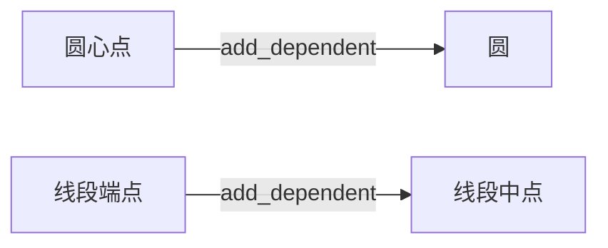

# 设计方案

---

## 1. 设计目标
构建一个支持 **动态参数化构造** 和 **自动级联更新** 的几何图形系统，具备以下特性：
- **灵活构造**：支持多种几何对象构造方式（如圆心+半径、三点共圆、对称点等）  
- **依赖感知**：自动追踪几何对象间的依赖关系（如圆依赖其圆心点）  
- **实时更新**：当基础对象（如点/线）变动时，所有依赖对象（如圆/交点）自动重新计算  
- **类型安全**：通过严格参数校验确保几何逻辑的合法性

---

## 2. 核心组件

### 2.1 `BaseGeometry` 基类
**定位**：所有几何对象的公共基类  
**核心职责**：依赖传播，对象绑定

### 2.2 `GeometryAdapter` 适配器
**定位**：构造逻辑的抽象封装层  
**核心职责**：参数计算与适配

---

## 3. 具体实现模式

### 3.1 圆（Circle）的实现
**适配器逻辑**：
```python
class CircleAdapter(GeometryAdapter):
    def __call__(self, *objs):
        match self.construct_type:
            case "PR":   # 圆心+半径
                self.center = objs[0].coord
                self.radius = objs[1]
            case "PPP":  # 三点共圆
                self.center, self.radius = three_points_circle(...)
            # 其他构造方式...
```

**对象定义**：
```python
class Circle(BaseGeometry):
    attrs = ["center", "radius", "area"]  # 声明需要绑定的属性
    def __init__(self, construct_type, *objs):
        self.adapter = CircleAdapter(construct_type, self, *objs)
```

### 3.2 点（Point）的实现
**复杂构造示例**：
```python
# 交点适配器逻辑（IntersectionLL 构造方式）
def __call__(self, *objs):
    line1, line2 = objs[0], objs[1]
    self.coord = intersection_line_line(line1, line2)

# 双交点对象（Points2）
class Points2(BaseGeometry):
    attrs = ["coord1", "coord2"]  # 同时绑定两个坐标
```

---

## 4. 依赖与更新机制

### 4.1 依赖关系建立


### 4.2 更新传播流程
```python
# 当圆心点移动时：
圆心点.update() 
  → 触发 circle.board_update_msg() 
  → 圆执行 adapter 重新计算半径/面积 
  → 圆触发其依赖对象（如切线）更新
```

---

## 5. 工厂函数体系

### 5.1 核心设计原则
- **命名直观**：`PointMidPP`（两点中点）、`Points2IntersectionCirCir`（两圆交点）  
- **参数强类型**：使用 `Point`/`LineLike` 等类型标注  
- **文档集成**：每个函数包含 Markdown 格式的参数说明

### 5.2 典型函数示例
```python
def PointVerticalPL(point: Point, line: LineLike, name: str = ""):
    """
    ## 构造垂足点
    - `point`: 原始点坐标
    - `line`: 目标直线/线段
    - 返回: 垂足点对象
    """
    return Point("VerticalPL", point, line, name=name)
```
